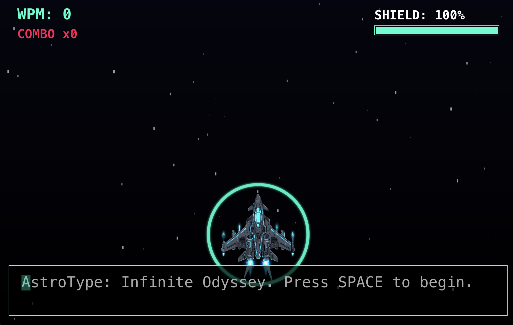
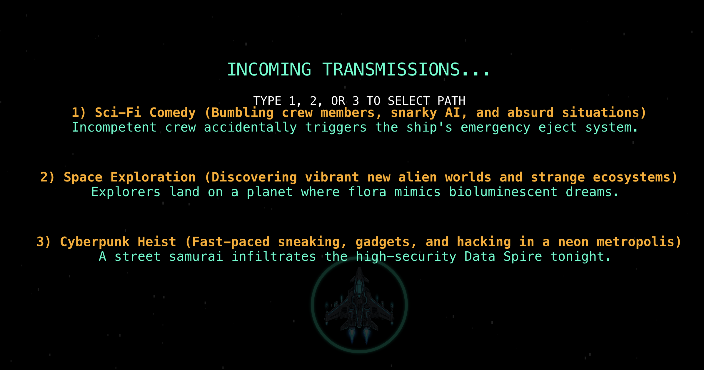
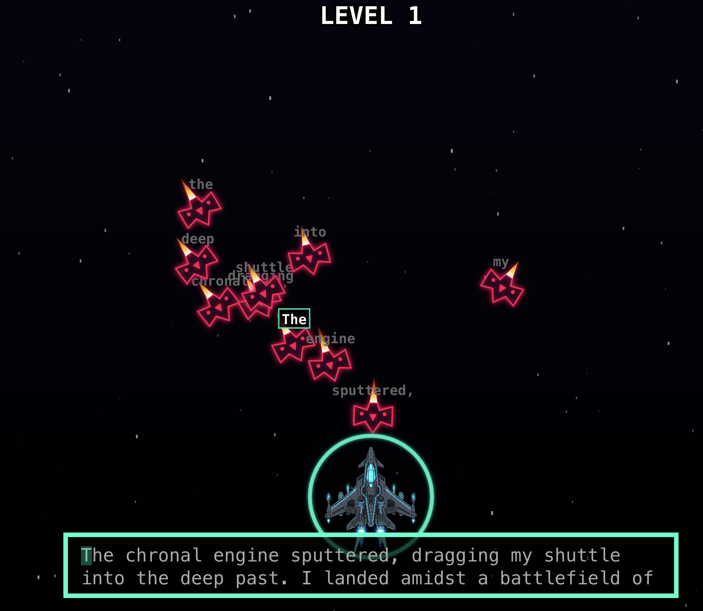
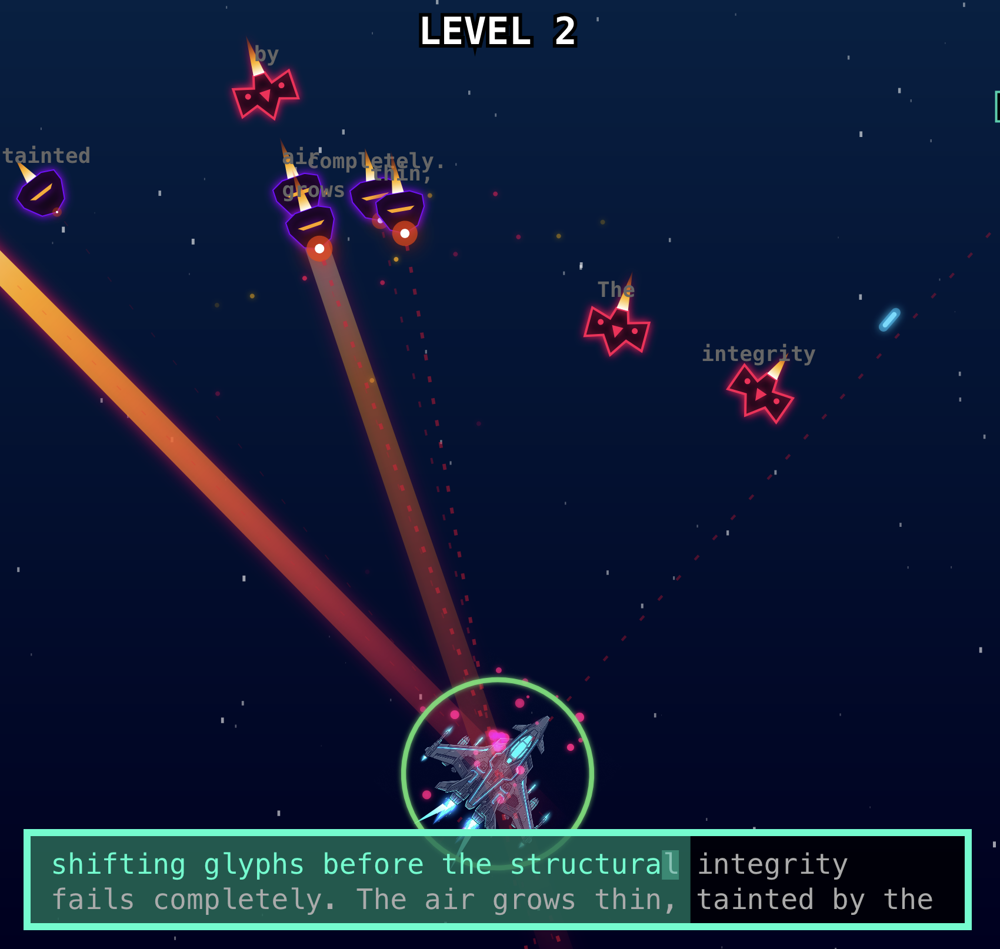
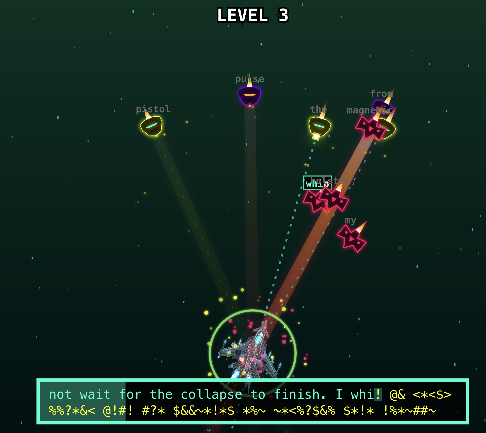
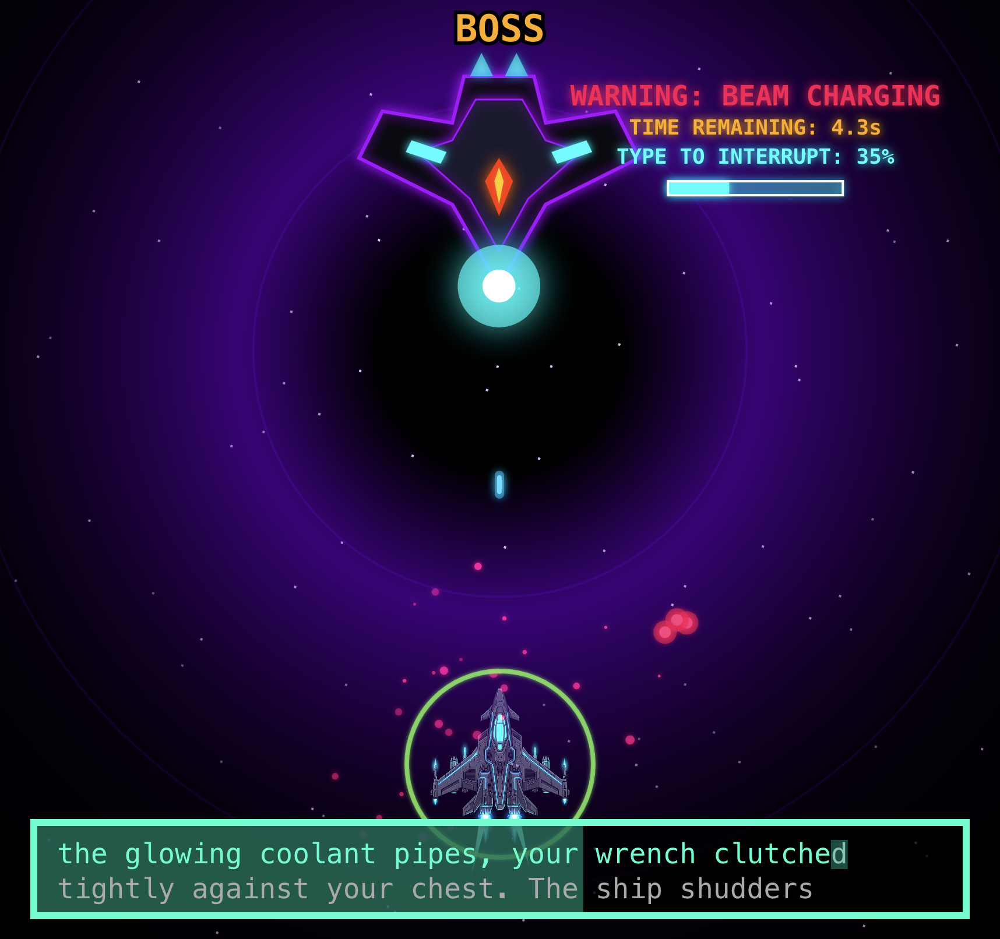
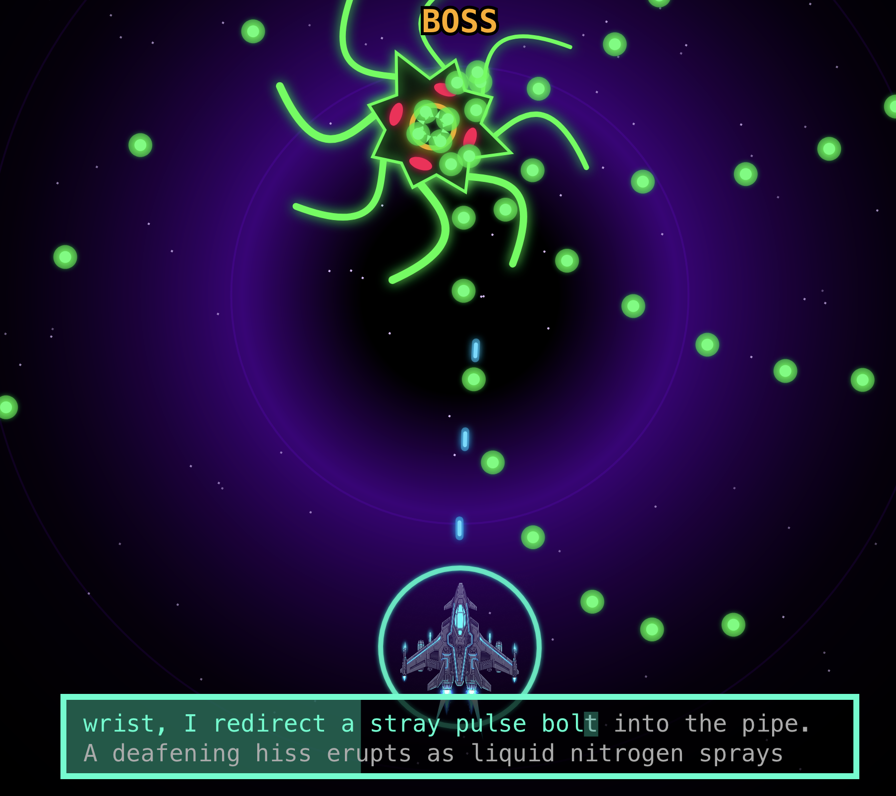
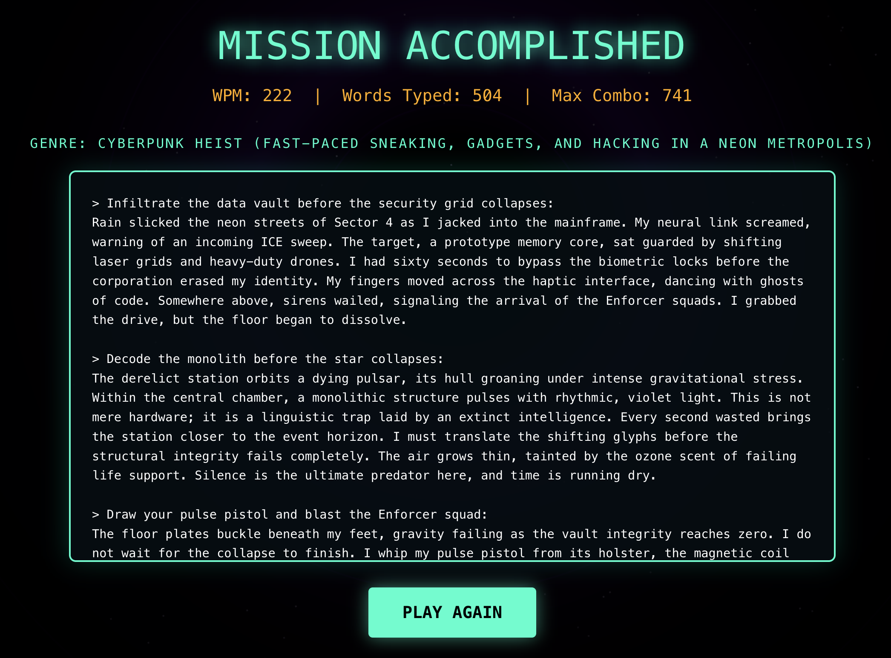
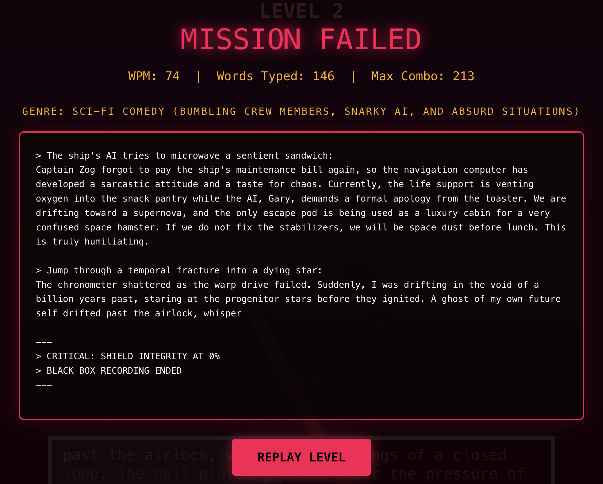
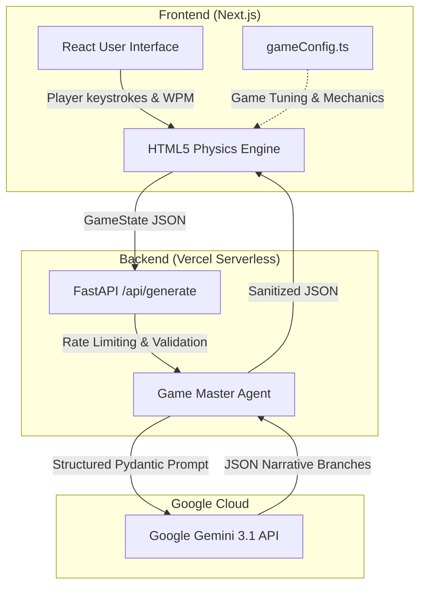

# 🌌 AstroTyper: Infinite Odyssey 

**🎮 [PLAY THE GAME LIVE HERE!](https://astrotyper.vercel.app)**

Welcome to **AstroTyper: Infinite Odyssey** — an AI-driven Sci-Fi Typing RPG powered by the **Google GenAI SDK**. 

This isn't your grandfather's typing game. It is a showcase of pure **Agentic Engineering**. Built from the ground up to demonstrate how Large Language Models (LLMs) can act as real-time, dynamic Game Masters, AstroTyper leverages structured Pydantic outputs and agentic workflows to seamlessly blend high-octane 60fps action with infinite AI storytelling.

| | | |
|:---:|:---:|:---:|
|  |  |  |
|  |  |  |
|  |  |  |

## 🔥 Why This is Mind-Blowing

*   **Pure Agentic Architecture:** We didn't just plug in an API; we engineered an agentic system. We adhered strictly to best practices, entirely rejecting "vibe coding" (which is essentially hope-driven development). Leveraging the Google GenAI SDK and the Gemini API, the backend Game Master is strictly governed by stateless memory graphs, robust Pydantic data bounds, and rigid system prompts that force the LLM to behave like a deterministic game engine rather than a stochastic chatbot.
*   **Centralized Specs & Framework Rules:** Instead of hallucinating features, our AI agent was anchored to a strict `game_design_spec.md` source of truth and global `AGENTS.md` constraints to ensure architectural consistency.
*   **Custom Agent Skills:** We developed explicit, executable skill files (like `/git-commit` and `/stride_threat_model`) that empowered the AI to autonomously navigate complex DevOps and testing workflows.
*   **STRIDE Threat Modeling:** We treated the GenAI integration as a security surface, generating a systematic `threat_model.md` to mitigate prompt injection and enforce rigid schema validation.
*   **Dynamic WPM Difficulty Scaling:** The Google Gemini API doesn't just write text; it *engineers* it. By passing your real-time Words-Per-Minute (WPM) to the backend, the LLM mathematically scales the word count, complexity, and sentence structure of the incoming wave to perfectly match your skill level.
*   **The "LLM-as-a-Judge" QA Suite:** How do you test an AI that can say anything? We built a pure Python offline evaluation suite (`run_evals.py`) that uses a secondary LLM judge to deterministically grade the Game Master against negative constraints. It ensures the AI *never* breaks the 4th wall, never hallucinates game mechanics, and always hits exact word count targets.
*   **Bullet Hell Meets Typing:** Forget static words on a screen. Every keystroke is a plasma bolt. You'll face a gauntlet of unique enemy units like parasitic Kamikaze-leeches, Plasma Interceptors, and evasive Scramblers. Survive long enough, and the AI will route you to epic multi-phase Boss Encounters—face down the massive Cybernetic Dreadnought, or unlock the terrifying **Biological Abomination** (a Secret Boss exclusively deployed against players who can sustain a blazing-fast WPM!)

## 🛠️ Tech Stack

*   **Frontend:** React, Next.js (App Router), HTML5 Canvas Engine, Vanilla CSS
*   **Backend:** Python, FastAPI, Vercel Serverless Functions
*   **AI:** Google Gemini API (via Google GenAI SDK)
*   **Testing:** Jest (Canvas Engine Math), Python LLM Judge (Prompt Evaluation)

### Architecture Diagram



---

## 🚀 Quick Start Guide

Want to run the game locally? Follow these steps!

### 1. Prerequisites
*   Node.js (v18+)
*   Python (3.10+)
*   A Google Gemini API Key

### 2. Environment Setup
Create a `.env.local` file in the root of the project for backend API secrets:
```env
GEMINI_API_KEY=your_gemini_api_key_here
GEMINI_MODEL=gemini-3.1-flash-lite
```
Additionally, all frontend game mechanics and tuning dials (e.g., maximum health, spawn rates, and boss difficulty) are centrally configured in the `src/gameConfig.ts` parameter file.

### 3. Install Frontend Dependencies
```bash
npm install
```

### 4. Install Backend Dependencies
Set up your Python virtual environment and install the rigidly pinned backend dependencies:
```bash
python3 -m venv .venv
source .venv/bin/activate
pip install -r requirements-dev.txt
```

### 5. Run the Game!
To run the full stack locally, you need to start both the Python backend and the Next.js frontend in separate terminal windows:

**Terminal 1: Start the Python Backend**
```bash
source .venv/bin/activate
uvicorn api.index:app --port 8000 --reload
```

**Terminal 2: Start the Next.js Frontend**
```bash
npm run dev
```
Navigate to `http://localhost:3000` in your browser and start typing!

---

## 🧪 Running the Test Suites

**1. Run the Frontend Math & Physics Tests (Jest)**
```bash
npx jest
```

**2. Run the AI Narrative Evaluations (Python LLM Judge)**
```bash
source .venv/bin/activate
python tests/eval/run_evals.py
```
